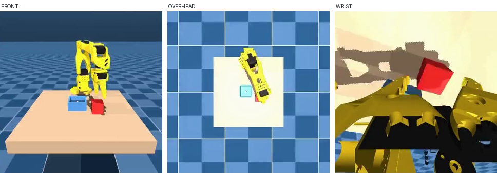
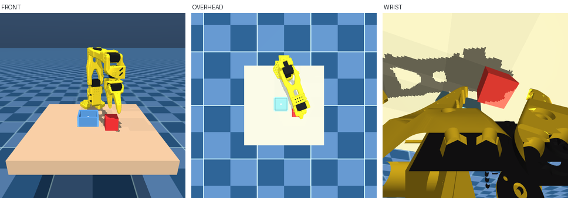

# so-arm101-pick-place

This repository is our reproduction of the environment behind
[gpudad/so101_pick_cube](https://huggingface.co/datasets/gpudad/so101_pick_cube),
GPU-DAD's SO-101 pick-and-place data set. We rebuilt that scene in MuJoCo, and
used the replica to generate a 1,000-episode pick-and-place dataset of our own:
[rovolabs/so-arm101-pick-place](https://huggingface.co/datasets/rovolabs/so-arm101-pick-place). Details below.

## The original Environment

This is a MuJoCo replica of the scene in
[gpudad/so101_pick_cube](https://huggingface.co/datasets/gpudad/so101_pick_cube)
by [gpudad](https://huggingface.co/gpudad). All fidelity numbers below are
measured against frames from that dataset.

*Episode 44, frame 16 — from the original
[gpudad/so101_pick_cube](https://huggingface.co/datasets/gpudad/so101_pick_cube) data set*

## The Replicated Environment

*The same episode and frame, rendered here, in our replicated world*

### How to View the Environment

    uv run run.py

Writes `world.png`: renders the scene seen from all three cameras --
front, overhead and wrist -- side by side.

| command | what you get |
| --- | --- |
| `uv run run.py` | all three views -> `world.png` |
| `uv run run.py --camera front` | camera view (`front`, `overhead`, `wrist`) |
| `uv run run.py --window` | an interactive window |
| `uv run run.py --help` | lists all options |

The scenes are plain MJCF, so you can skip `run.py` altogether and open one in
MuJoCo's own viewer:

    python -m mujoco.viewer --mjcf=assets/scene_front.xml

That gives you the scene as-loaded.

## The Dataset

A companion dataset of **1,000 episodes** of the pick-and-place cube task,
recorded entirely in this replicated environment. Every episode is a
success -- the cube ends up in the bin.

| episodes | controller |
| --- | --- |
| 100 | GPU-DAD's recorded action data, replayed in our replicated world |
| 400 | a SmolVLA policy trained on GPU-DAD's own data, acting in our replicated world |
| 500 | our inverse-kinematics expert, acting in our replicated world |

[rovolabs/so-arm101-pick-place](https://huggingface.co/datasets/rovolabs/so-arm101-pick-place)

## The IK Expert

`ik_expert.py` is the same controller that generated the 500
inverse-kinematics episodes in the data set above. To watch it work:

    uv run example.py

It runs one whole pick-and-place attempt, and writes `example.gif` -- a recording of it from
start to finish from all three cameras side by side.

| command | what it does |
| --- | --- |
| `uv run example.py` | a new random placement every time |
| `uv run example.py --seed 7` | plays the specific seed called |
| `uv run example.py --camera wrist` | one camera only: `front`, `overhead` or `wrist` |

Without a flag it draws one of a million seeds -- 0 to 999,999 -- at random. `--seed` takes **any whole
number** and always produces that same seed placement of the assets on the table.

Every run says plainly whether the attempt worked, and prints the seed it used:

    SUCCESS  the cube ended up in the bin
      placement seed 7   cube (0.175, +0.066)   bin (0.181, -0.061)   273 steps

A failure is a real outcome rather than an error -- the expert drives through
physics and can drop the cube -- so it is reported the same way, and says which
phase it got to.

## Environment Files

| file | what it is | MAE vs real (0-255) |
| --- | --- | --- |
| `assets/scene_front.xml` | Color-matched to GPU-DAD's FRONT camera. | 10.58 |
| `assets/scene_overhead.xml` | Color-matched to GPU-DAD's OVERHEAD camera. | 4.60 |
| `assets/scene_wrist.xml` | Color-matched to GPU-DAD's WRIST camera. | 12.87 |

MAE is mean absolute pixel error, 0-255 per channel, against real GPU-DAD frames. Lower is closer.

## Why there is More than One Environment File

The three scenes differ in paint and lighting only -- geometry and physics are
identical across all of them. To run a policy, drive ONE scene as the physics truth and mirror its state into the other two, rendering each camera view from the scene that was color-matched to it.

## How to Cite

If you use this environment, please cite it:

    Rasheed A., Gallimore K., Johnson E., Subbiah V. (2026).
    so-arm101-pick-place: a MuJoCo reconstruction of the
    GPU-DAD SO-101 pick-cube scene (version 1.0.0).
    URL: https://github.com/Rovo-Labs/so-arm101-pick-place

Machine-readable metadata lives in [CITATION.cff](CITATION.cff) -- GitHub's
"Cite this repository" button reads it directly. Released under Apache-2.0;
see `LICENSE` and `NOTICE`.
