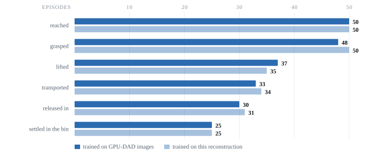

# Results

How closely does this reconstruction match the real thing? Two measurements: one
with a policy driving the robot (closed-loop), one with a policy just watching
(open-loop).

## Closed-loop: a policy trained on GPU-DAD's images performs identically here

The strongest test of a reconstruction is whether a policy can tell the difference.

Two SmolVLA policies were trained on **the same 50 source trajectories, frame for
frame** — 4,546 frames each, per-episode lengths matching exactly, in order. The
only difference between the two training sets is which renderer produced the pixels.

| | **cross-domain** | **same-domain** |
|---|---|---|
| trained on | GPU-DAD's own rendered images | this reconstruction |
| training set | 50 episodes, 4,546 frames | ← the same 50, frame for frame |
| seen a reconstructed frame before? | **never** | trained in the same renderer |
| evaluated in | this world | this world |
| **success** | **25 / 50** | **25 / 50** |

Both were then run in this world on the same 50 held-out episodes, disjoint from
either training split, under identical conditions.

**The difference is zero.** A policy that had never seen a single frame of this
reconstruction performed exactly as well in it as one trained on it directly. To
that policy, our renderer and GPU-DAD's are interchangeable.

## Where the episodes go

Success is one number at the end of a chain of things that all have to work. This
counts how many of the 50 episodes survive each stage — grasping the cube, getting
it off the table, carrying it, and releasing it into the bin.

| stage | cross-domain | same-domain |
|---|---|---|
| reached the cube | 50 | 50 |
| grasped it | 48 | 50 |
| lifted it off the table | 37 | 35 |
| transported it to the bin | 33 | 34 |
| released in | 30 | 31 |
| **settled in the bin** | **25** | **25** |

This matters more than the final number alone. The two policies track each other
within one or two episodes at **every** stage, not just at the end — so they are
not arriving at the same score by different routes. They behave the same way the
whole way through. Lifting is the single biggest hurdle for both.

## Open-loop: how much the images themselves differ

A second, finer measurement. Take one policy, freeze it, and change nothing but
the pixels it sees — real frames, then our reconstruction of the same moment. How
differently does it act?

| | value |
|---|---|
| paired difference between its actions | **0.0181 rad** |
| 95% confidence interval | [0.0164, 0.0200] |
| as a share of the robot's physical joint range | **0.64%** |

Swapping every real image for a reconstructed one moves the policy's output by
under two-thirds of one percent of what the joints can travel.

<!-- FLAGGED FOR REVIEW: the improvement line below may be removed before release. -->
That is down from 0.0284 rad in our first reconstruction of this scene, a **36%
reduction** in how much the renderer swings a policy's behaviour.
<!-- END FLAGGED -->

It holds joint by joint rather than being carried by one of them — every joint sits
between 0.02% and 1.63% of its own control span, with the wrist roll lowest and the
gripper highest.

## How this was measured

- **Policies:** SmolVLA, chunk size 50, batch 64, learning rate 1e-4, frozen vision
  encoder, `train_expert_only`, training seed 1000, 10k steps.
- **Task string**, training and evaluation, both policies:
  `Pick up the red cube and place it in the blue box.`
- **Evaluation:** 50 held-out episodes, seed 0, action horizon 50, max 450 steps
  (15 s at 30 Hz control), plus a 15-second tail after success so the cube settles
  before the outcome is recorded.
- **Success** means the cube came to rest inside the bin. Every episode was confirmed
  from its settled video rather than from an instantaneous check at the moment of
  release — a cube still in the air above the bin has not landed in it yet.
<!-- FLAGGED FOR REVIEW: checkpoint names are not chosen yet. Do NOT publish the
     internal tags -- they leak world revisions and dataset naming. -->
- **Checkpoints:** both policies are published on Hugging Face, not in this
  repository: [CROSS-DOMAIN CHECKPOINT](INSERT LINK WHEN READY) and
  [SAME-DOMAIN CHECKPOINT](INSERT LINK WHEN READY).
<!-- END FLAGGED -->
- **Source:** the 50 training and 50 held-out episodes come from
  [gpudad/so101_pick_cube](https://huggingface.co/datasets/gpudad/so101_pick_cube),
  and are disjoint.
